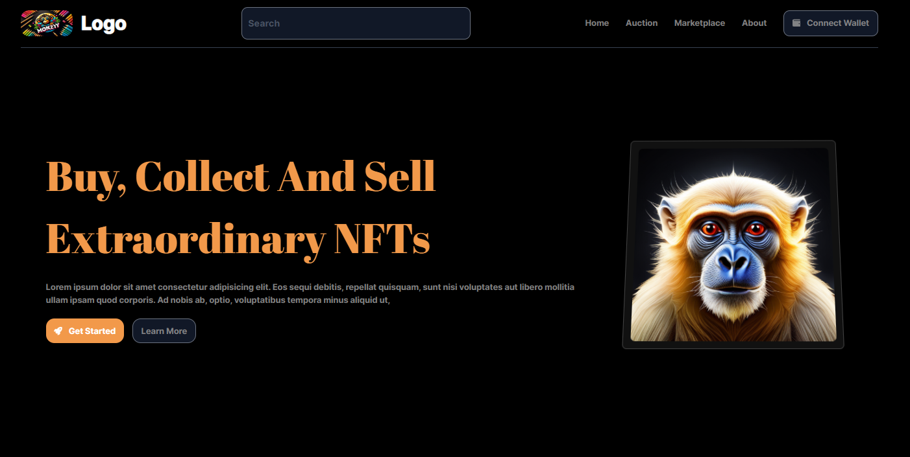

<div align="center">
  

  <h1>🐒 Monkey Bonkey 🍌</h1>

  <p>
    <!-- Add a catchy tagline here! -->
    Bringing your web projects to life with Framer Motion!
  </p>
</div>


## ✨ About

Monkey Bonkey is a NFT Landing page. Built with React and powered by the magic of Framer Motion. For Practice purpose.

## 💻 Getting Started

### Installation

1. Clone the repository:

   ```bash
   git clone https://github.com/iftekharalammithu/Monkey-Bonkey-Project.git
   ```

2. Install dependencies:

   ```bash
   npm install
   ```

3. Start the development server:
   ```bash
   npm start
   ```

## 🤝 Contributing

We welcome contributions! Please read our [contributing guidelines](CONTRIBUTING.md) for more details.

Follow on social media:

[
](https://x.com/M1thuChowdhury)
[
](https://www.linkedin.com/in/iftekharalammithu/)
[
](https://www.instagram.com/iftekharalammithu/)

<div style="text-align: center;">
  <a href="https://www.buymeacoffee.com/iftekharalammithu">
    
  </a>
</div>
